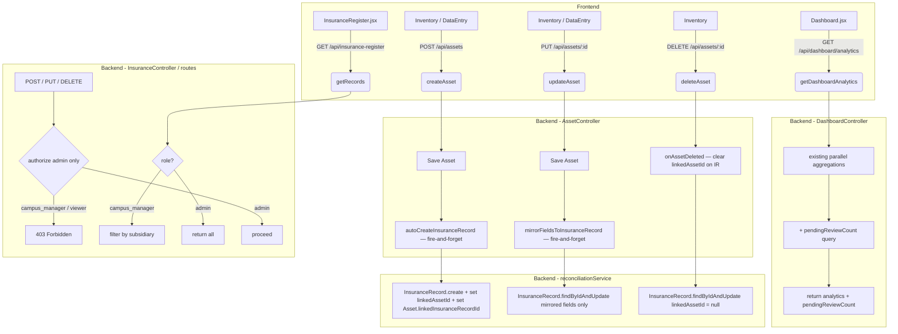

# Design Document — Asset Insurance Auto-Sync

## Overview

The Asset Insurance Auto-Sync feature connects the Asset Register and Insurance Register so that creating or editing an asset automatically propagates the relevant data to a linked insurance record. The goal is to eliminate duplicate data entry for campus managers, give admins a clear signal of which auto-created records still need their attention ("Pending Review"), and lock down write access to the Insurance Register so only admins can modify it directly.

### Key design decisions

- **Fire-and-forget async propagation** — the auto-sync runs after the main asset save is complete and never blocks the HTTP response. A database failure in the sync step logs an error but does not fail the asset operation. This matches the existing `autoLinkAsset` / `propagateAssetStatusToInsurance` pattern already present in AssetController.
- **Reuse reconciliation service** — the existing `reconciliationService` already handles bidirectional link management (`linkAssetToInsuranceRecord`, `unlinkAsset`, `onAssetDeleted`). The new sync helpers will be added to the same service so all link logic stays in one place.
- **No new endpoints** — the dashboard analytics endpoint (`GET /api/dashboard/analytics`) already aggregates all data in a single parallel query fan-out; we add one count query to that same fan-out. The frontend `fetchDashboardAnalytics` call requires no changes.
- **Route-level RBAC change** — the Insurance Register `POST` and `PUT` routes currently `authorize('admin', 'campus_manager')`. They will be changed to `authorize('admin')` only. The existing `DELETE` route is already admin-only.
- **Bulk import exclusion** — the bulk import controller (`BulkImportController.js`) calls `Asset.create` directly and never touches the reconciliation service or the auto-sync path, so the exclusion is already satisfied by design. The only change needed is restricting the route to admin only (Req 7.3).

---

## Architecture



---

## Components and Interfaces

### 1. `InsuranceRecord` model — new `Pending Review` status

Add `'Pending Review'` to the `status` enum. No other schema changes are required.

```
status enum (updated):
  'Active' | 'Insured' | 'Request Removal' | 'Request Addition' |
  'Request Update' | 'Removed' | 'Pending Review'
```

### 2. `reconciliationService` — two new helpers

**`autoCreateInsuranceRecord(asset, userId)`**

Creates a new InsuranceRecord from a given asset using the field mapping table, sets `status = 'Pending Review'`, sets the bidirectional link, and returns the created record.

| Input | Output |
|---|---|
| `asset` (Mongoose doc) | created `InsuranceRecord` doc |
| `userId` (ObjectId) | sets `createdBy` |

Field mapping applied:

| Asset field | InsuranceRecord field |
|---|---|
| `subsidiary` | `subsidiary` |
| `insuranceClass` | `classOfInsurance` |
| `description` | `descriptionDetails` |
| `description` | `assetOrInsurableRisk` |
| `serialNumber` | `serialNumber` |
| `quantity` | `quantity` |
| `unitPrice` | `unitCost` |
| `sumInsured` | `sumInsured` |

Insurance-specific fields (`monthlyPremium`, `annualPremium`, `rate`, `policyReference`, `vendor`, `interestNoted`) are explicitly set to `0` / `''` so they are never inherited from any ambient state.

After creating the InsuranceRecord, the helper calls `Asset.findByIdAndUpdate` to set `linkedInsuranceRecordId` on the asset.

**`mirrorFieldsToInsuranceRecord(assetId, updatedFields)`**

Finds the InsuranceRecord linked to the given asset and updates only the mirrored fields. Insurance-specific fields and `status` are excluded from the update payload via an explicit allowlist. If the InsuranceRecord does not exist or the asset has no link, the function is a no-op.

### 3. `AssetController` — three modifications

**`createAsset`** — after `Asset.create` succeeds, fire-and-forget:

```js
autoCreateInsuranceRecord(asset, req.user._id).catch((e) =>
  logger.warn(`Auto-sync failed for Asset ${asset.assetId}: ${e.message}`)
);
```

The existing `autoLinkAsset` call (which tries to find an already-existing matching insurance record) is **removed** for single-asset creation because `autoCreateInsuranceRecord` now handles link establishment. The two would conflict (both trying to set `linkedInsuranceRecordId`).

**`updateAsset`** — after the asset is saved, if `asset.linkedInsuranceRecordId` exists, fire-and-forget:

```js
mirrorFieldsToInsuranceRecord(asset._id, req.body).catch((e) =>
  logger.warn(`Field mirror failed for Asset ${asset.assetId}: ${e.message}`)
);
```

**`deleteAsset`** — no change needed; `onAssetDeleted` already clears the back-reference on the InsuranceRecord and is called synchronously (awaited) before `asset.deleteOne()`.

### 4. `InsuranceController` — RBAC changes

**`insuranceRoutes.js`** changes:

| Route | Current auth | New auth |
|---|---|---|
| `POST /` | `authorize('admin', 'campus_manager')` | `authorize('admin')` |
| `PUT /:id` | `authorize('admin', 'campus_manager')` | `authorize('admin')` |
| `DELETE /:id` | `authorize('admin')` | no change |
| `POST /bulk` | `authorize('admin', 'campus_manager')` | no change (bulk insurance import stays as-is) |

The `getRecords` handler already filters by `subsidiary` for `campus_manager` — no change needed there.

### 5. `assetRoutes.js` — bulk import RBAC change

| Route | Current auth | New auth |
|---|---|---|
| `POST /bulk` | `authorize('admin', 'campus_manager')` | `authorize('admin')` |

### 6. `DashboardController` — add `pendingReviewCount`

Add one additional aggregation to the existing `Promise.all` fan-out:

```js
InsuranceRecord.countDocuments({
  ...campusFilter,
  status: 'Pending Review',
})
```

Include `pendingReviewCount` in the JSON response alongside the existing fields.

For `campus_manager`, the `campusFilter` scopes the count to their campus — consistent with how other analytics are scoped.

### 7. Frontend — `InsuranceRegister.jsx`

**Role-based rendering:**

- Import `useAuth` from `@/context/AuthContext`.
- Derive `isAdmin` from the auth context.
- Conditionally render the "Add Record" button, per-row Edit and Delete buttons, and the Bulk Import tab based on `isAdmin`.
- The `handleSubmit` and `handleDelete` functions can remain as-is; they will simply never be reachable for non-admin users.

**Pending Review status support:**

- Add `'Pending Review'` to the `statuses` array used in the filter dropdown and edit form.
- Add `'Pending Review'` to `statusColour`:
  ```js
  'Pending Review': 'bg-amber-100 text-amber-700'
  ```
- Add a status filter dropdown (or extend the existing table controls) that allows filtering by status, including `'Pending Review'`.

### 8. Frontend — `Dashboard.jsx`

**Pending Review badge (admin only):**

- Import `useAuth` to get `isAdmin`.
- Read `pendingReviewCount` from the analytics data object.
- Render a new card/badge in the KPI section, visible only when `isAdmin` is true:
  - Label: "Pending Review"
  - Value: `data.pendingReviewCount`
  - Colour: amber (consistent with the Insurance Register badge)
  - Navigates to `/insurance-register?status=Pending+Review` (or sets a filter via React Router state) when clicked.

---

## Data Models

### `InsuranceRecord` (updated schema fragment)

```js
status: {
  type: String,
  enum: [
    'Active', 'Insured', 'Request Removal', 'Request Addition',
    'Request Update', 'Removed', 'Pending Review',   // ← NEW
  ],
  default: 'Active',
},
```

All other fields remain unchanged. The `linkedAssetId` field already exists in the schema.

### `Asset` (no schema changes)

The `linkedInsuranceRecordId` and `sumInsured` fields already exist. The `pre('save')` hook already computes `sumInsured = quantity * unitPrice`, so `updateAsset` must also set this when `quantity` or `unitPrice` changes (already handled in `updateAsset` with an explicit recomputation block).

### Field mapping table (canonical reference)

| Asset field | Value source | InsuranceRecord field |
|---|---|---|
| `subsidiary` | direct | `subsidiary` |
| `insuranceClass` | direct | `classOfInsurance` |
| `description` | direct | `descriptionDetails` |
| `description` | direct | `assetOrInsurableRisk` |
| `serialNumber` | direct | `serialNumber` |
| `quantity` | direct | `quantity` |
| `unitPrice` | direct | `unitCost` |
| `sumInsured` (= qty × price) | computed | `sumInsured` |
| *(new record)* | constant | `status = 'Pending Review'` |
| *(new record)* | constant | `monthlyPremium = 0` |
| *(new record)* | constant | `annualPremium = 0` |
| *(new record)* | constant | `rate = 0` |
| *(new record)* | constant | `policyReference = ''` |
| *(new record)* | constant | `vendor = ''` |
| *(new record)* | constant | `interestNoted = ''` |

---

## Correctness Properties

*A property is a characteristic or behavior that should hold true across all valid executions of a system — essentially, a formal statement about what the system should do. Properties serve as the bridge between human-readable specifications and machine-verifiable correctness guarantees.*

### Redundancy Reflection

Before finalising properties, redundancy is eliminated:

- 1.2 (status = "Pending Review") and 1.4 (insurance-specific fields blank) are subsumed into **Property 1** (full field mapping), which covers the entire auto-creation invariant.
- 1.5 (bidirectional link) and 3.1 (symmetry invariant) are combined into **Property 2** — a single round-trip link property.
- 2.1 (mirrored fields updated) and 2.2 (insurance-specific fields untouched) are combined into **Property 3**.
- 2.3 (sumInsured = qty × price) stands alone as a pure computation property — **Property 4**.
- 2.4 (Pending Review status preserved during mirror) stands alone — **Property 5**.
- 3.2 (delete asset → clear linkedAssetId on IR) — **Property 6**.
- 3.3 (delete IR → clear linkedInsuranceRecordId on asset + set insuranceStatus Not Insured) — **Property 7**.
- 5.1 and 5.5 (dashboard count by role) are combined into **Property 8**.
- 6.1 (campus_manager GET filter) — **Property 9**.
- 6.2 + 6.5 (403 on mutation for non-admin) — **Property 10**.
- 6.3 (campus_manager sees read-only UI) and 4.2 (amber badge for Pending Review) — **Properties 11 and 12**.
- 7.1 + 7.2 (bulk import excludes auto-sync) — **Property 13**.

---

### Property 1: Auto-creation field mapping invariant

*For any* valid asset creation payload (with any combination of `subsidiary`, `insuranceClass`, `description`, `serialNumber`, `quantity`, `unitPrice`), after `POST /api/assets`, the resulting auto-created InsuranceRecord SHALL have:
- `subsidiary`, `classOfInsurance`, `descriptionDetails`, `assetOrInsurableRisk`, `serialNumber`, `quantity`, `unitCost`, `sumInsured` mapped from the asset per the mapping table,
- `status = 'Pending Review'`,
- `monthlyPremium = 0`, `annualPremium = 0`, `rate = 0`, `policyReference = ''`, `vendor = ''`, `interestNoted = ''`,
- `createdBy` equal to the requesting user's `_id`.

**Validates: Requirements 1.2, 1.3, 1.4, 1.6**

---

### Property 2: Bidirectional link symmetry

*For any* asset created via `POST /api/assets` (single record), after the auto-sync completes:
- `Asset.linkedInsuranceRecordId` SHALL equal the new InsuranceRecord's `_id`, AND
- `InsuranceRecord.linkedAssetId` SHALL equal the asset's `_id`.

**Validates: Requirements 1.5, 3.1**

---

### Property 3: Mirror update — mirrored fields propagate, insurance-specific fields preserved

*For any* asset that has a linked InsuranceRecord, and *for any* update to the asset's mirrored fields (`subsidiary`, `insuranceClass`, `description`, `serialNumber`, `quantity`, `unitPrice`), after `PUT /api/assets/:id`:
- The linked InsuranceRecord's mirrored fields SHALL reflect the new asset values,
- The InsuranceRecord's insurance-specific fields (`monthlyPremium`, `annualPremium`, `rate`, `policyReference`, `vendor`, `interestNoted`) SHALL remain at their pre-update values.

**Validates: Requirements 2.1, 2.2**

---

### Property 4: Sum insured computation round-trip

*For any* quantity `q > 0` and unit price `p ≥ 0`, after updating an asset with those values:
- `Asset.sumInsured` SHALL equal `q × p`,
- `InsuranceRecord.sumInsured` (on the linked record) SHALL equal `q × p`.

**Validates: Requirements 2.3**

---

### Property 5: Pending Review status preserved during field mirroring

*For any* asset update on an asset whose linked InsuranceRecord has `status = 'Pending Review'`, after the mirror operation completes, `InsuranceRecord.status` SHALL still equal `'Pending Review'`.

**Validates: Requirements 2.4**

---

### Property 6: Asset deletion preserves Insurance Record, clears back-reference

*For any* asset that has a linked InsuranceRecord, after `DELETE /api/assets/:id`:
- The InsuranceRecord SHALL still exist in the database,
- `InsuranceRecord.linkedAssetId` SHALL equal `null`.

**Validates: Requirements 3.2**

---

### Property 7: Insurance Record deletion clears Asset link and sets Not Insured

*For any* InsuranceRecord that has a linked Asset, after `DELETE /api/insurance-register/:id`:
- `Asset.linkedInsuranceRecordId` SHALL equal `null`,
- `Asset.insuranceStatus` SHALL equal `'Not Insured'`.

**Validates: Requirements 3.3**

---

### Property 8: Dashboard pendingReviewCount is correct and role-scoped

*For any* set of InsuranceRecords across any campuses:
- When queried as admin, `GET /api/dashboard/analytics` SHALL return `pendingReviewCount` equal to the total count of all InsuranceRecords with `status = 'Pending Review'` across all campuses.
- When queried as a campus_manager for campus C, `pendingReviewCount` SHALL equal the count of InsuranceRecords with `status = 'Pending Review'` AND `subsidiary = C`.
- `pendingReviewCount` SHALL be absent from, or zero in, the dashboard response for viewer users.

**Validates: Requirements 5.1, 5.4, 5.5**

---

### Property 9: Campus manager GET returns only own-campus records

*For any* campus_manager user assigned to campus C, and *for any* set of InsuranceRecords across multiple campuses, `GET /api/insurance-register` SHALL return only records where `subsidiary = C`.

**Validates: Requirements 6.1**

---

### Property 10: Non-admin mutation requests receive 403

*For any* campus_manager or viewer user, and *for any* request body or `:id` parameter, `POST /api/insurance-register`, `PUT /api/insurance-register/:id`, and `DELETE /api/insurance-register/:id` SHALL return HTTP 403.

**Validates: Requirements 6.2, 6.5**

---

### Property 11: InsuranceRegister renders read-only for campus_manager

*For any* campus_manager user session, the Insurance Register page SHALL NOT render an "Add Record" button, per-row Edit controls, or per-row Delete controls.

**Validates: Requirements 6.3**

---

### Property 12: Pending Review status badge uses amber colour

*For any* InsuranceRecord with `status = 'Pending Review'`, the status badge rendered in the Insurance Register table SHALL use amber/orange colour classes (i.e., a CSS class matching `amber`).

**Validates: Requirements 4.2**

---

### Property 13: Bulk import does not trigger auto-sync

*For any* set of valid asset rows submitted via `POST /api/assets/bulk`:
- No InsuranceRecord SHALL be created for any of the imported assets,
- Each imported asset's `linkedInsuranceRecordId` SHALL equal `null`.

**Validates: Requirements 7.1, 7.2**

---

## Error Handling

| Scenario | Handling |
|---|---|
| `InsuranceRecord.create` fails during auto-sync on asset creation | Catch in fire-and-forget `.catch()`; log warning with asset ID and error message; asset creation response is still `201`. |
| `InsuranceRecord.findByIdAndUpdate` fails during field mirror on asset update | Catch in fire-and-forget `.catch()`; log warning; asset update response is still `200`. |
| Asset has no `linkedInsuranceRecordId` when update fires | `mirrorFieldsToInsuranceRecord` performs a guard check; exits silently — no error, no log noise. |
| `onAssetDeleted` fails (already awaited synchronously) | The error propagates and the `deleteAsset` handler returns `500`. This is intentional — if we cannot clear the back-reference, the delete should not silently succeed and leave a dangling pointer. |
| Campus manager attempts `POST /PUT /DELETE` on insurance routes | `authorize('admin')` middleware returns `403` with message `"Access denied. Required role: admin."` |
| Viewer attempts any request on insurance routes | Same `authorize` middleware handles this; `403` returned. |
| `pendingReviewCount` query fails inside dashboard analytics | The dashboard `try/catch` already returns `500`. Because the count query is added to the same `Promise.all`, a single query failure will cause the whole analytics call to fail — acceptable given the dashboard already handles the 500 case gracefully with a retry button. |

---

## Testing Strategy

### Unit tests (example-based)

These cover specific scenarios and edge cases:

- **Auto-creation skipped on bulk import** — call `bulkImport` with a valid file and assert no `InsuranceRecord.create` was called (mock).
- **Auto-creation failure does not fail asset creation** — mock `InsuranceRecord.create` to throw; assert `createAsset` still returns `201`.
- **Mirror failure does not fail asset update** — mock `InsuranceRecord.findByIdAndUpdate` to throw; assert `updateAsset` still returns `200`.
- **Admin can change status away from Pending Review** — admin sends `PUT` with `status: 'Active'` on a `Pending Review` record; assert status changes.
- **Manual link clear on asset clears InsuranceRecord back-reference** — update asset with `linkedInsuranceRecordId: null`; assert `InsuranceRecord.linkedAssetId` is cleared.
- **Two assets cannot link to same InsuranceRecord** — attempt to link a second asset; assert the second link is rejected.
- **Two InsuranceRecords cannot link to same Asset** — attempt to link a second InsuranceRecord; assert the second link is rejected.
- **Admin sees all Insurance Register controls** — render InsuranceRegister with admin user; assert Add, Edit, Delete elements are present in the DOM.
- **Clicking Pending Review badge navigates to filtered Insurance Register** — simulate click; assert navigation to `/insurance-register?status=Pending+Review`.

### Property-based tests

Use **fast-check** (TypeScript/JavaScript PBT library) for all property tests. Each test runs a minimum of **100 iterations**.

Test tag format: `// Feature: asset-insurance-auto-sync, Property {n}: {property_text}`

| Test | Generator | Assertion |
|---|---|---|
| Prop 1 — Field mapping invariant | Random `subsidiary` (string), `insuranceClass` (from enum), `description` (non-empty string), `serialNumber` (alphanumeric string), `quantity` (integer 1–1000), `unitPrice` (float 0–1,000,000) | InsuranceRecord fields match mapping table; `status = 'Pending Review'`; insurance-specific fields are zero/empty |
| Prop 2 — Bidirectional link symmetry | Same generator as Prop 1 | `asset.linkedInsuranceRecordId` equals created IR `_id`; `ir.linkedAssetId` equals asset `_id` |
| Prop 3 — Mirror update preserves insurance-specific fields | Random linked asset + random delta for mirrored fields + pre-set insurance-specific field values | After update, mirrored fields reflect delta; insurance-specific values unchanged |
| Prop 4 — Sum insured computation | Random `quantity` (integer 1–10,000) + `unitPrice` (float 0–1,000,000) | `asset.sumInsured = q × p`; `ir.sumInsured = q × p` |
| Prop 5 — Pending Review preserved during mirror | Linked asset + IR with `status = 'Pending Review'` + random field delta | `ir.status` remains `'Pending Review'` after mirror |
| Prop 6 — Asset deletion preserves IR | Random linked asset + IR | After delete: IR still exists; `ir.linkedAssetId = null` |
| Prop 7 — IR deletion clears asset link | Random linked IR + asset | After delete: `asset.linkedInsuranceRecordId = null`; `asset.insuranceStatus = 'Not Insured'` |
| Prop 8 — Dashboard count correctness | Random mix of IR records with varying statuses across campuses; random user role | Count returned matches actual count of `Pending Review` records, scoped by role |
| Prop 9 — Campus manager GET filter | Random campus_manager + random set of IRs across ≥ 2 campuses | Response contains only records for the user's campus |
| Prop 10 — Non-admin mutation 403 | Random campus_manager or viewer user + random request body | All three mutation methods return 403 |
| Prop 11 — Read-only UI for campus_manager | Random campus_manager auth context | InsuranceRegister renders without Add/Edit/Delete controls |
| Prop 12 — Amber badge for Pending Review | Any record with `status = 'Pending Review'` | Rendered badge contains `amber` CSS class |
| Prop 13 — Bulk import no auto-sync | Random valid bulk import payload (1–100 asset rows) | Zero InsuranceRecords created; all `linkedInsuranceRecordId` are null |

**Property test configuration:**

- Each property test is tagged with the format above.
- Backend property tests run against an in-memory MongoDB instance (using `mongodb-memory-server`) to keep tests fast and isolated.
- Frontend property tests use `@testing-library/react` with a mock auth context.
- Minimum 100 iterations per test (fast-check default is 100; no change needed).
